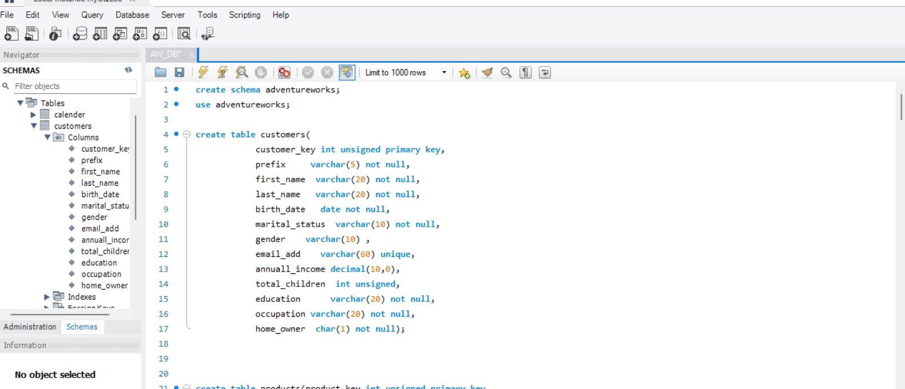
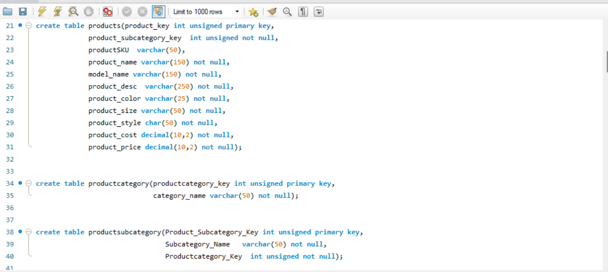
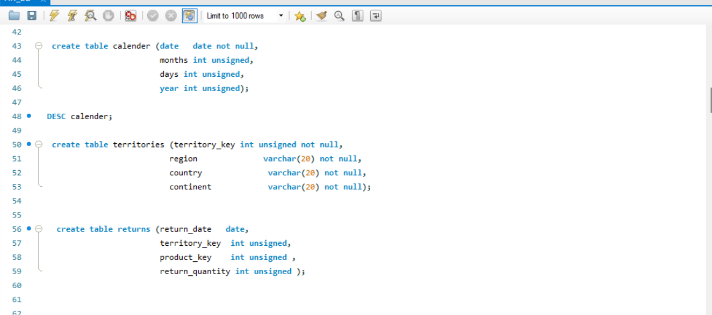
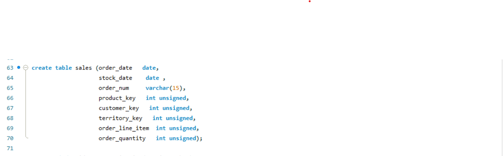
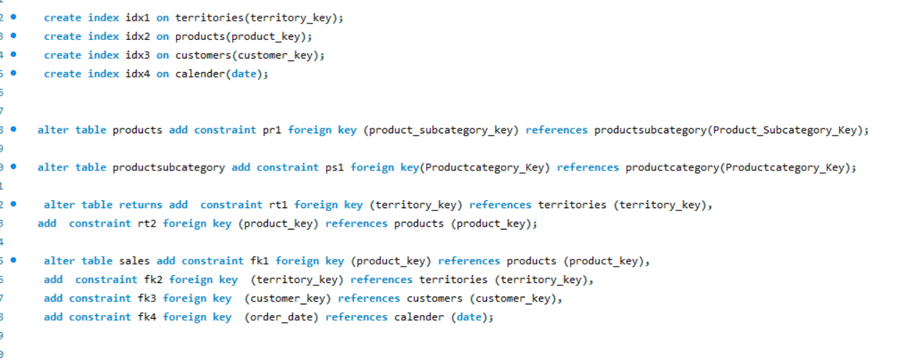
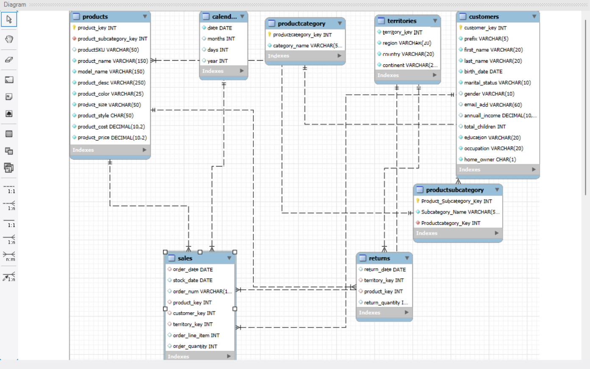

# Adventure works Database Analysis

## Introduction

The AdventureWorks database is an SQL project designed to manage sales, customer data, product inventory, and geographic distribution for a retail-based system. 
This report analyzes the database structure, table relationships, and potential business insights.

## Project Objectives

The objectives of this project are:

1. To analyze the structure and relationships within the AdventureWorks database.

2. To identify key insights regarding customer behavior, product performance, and sales distribution.

3. To provide data-driven recommendations for improving business operations.

4. To facilitate better decision-making through structured database analysis.

## Database Overview

The database consists of multiple tables, each serving a distinct function. 
The key tables include:
- Customers: Stores customer-related details
  

- Products: Maintains product details
- Product category and subcategory : Categorizes products into different groups
   

- Calender: Stores time-related data for analysis
- Territories: Stores geographical information
- Returns: Tracks product returns
   

- Sales: Records transactions and order details
  

## Constraints
They are used to limit what type of data can go into any given table. This way, we can ensure the reliability and accuracy of the data present in the table. 
Thus, if there occurs any violation between the data action and the constraint, the action is aborted as a result.

##  Table Relationships

- customers is linked to sales via customer_key

- products is linked to sales and returns via product_key

- productsubcategory is linked to productcategory via productcategory_key

- sales and returns are linked to territories via territory_key

- sales is linked to calendar via order_date
  

## BUSINESS INSIGHTS:
The structure of the AdventureWorks database allows for various business analyses:
1) Customer Behavior: Understanding purchase patterns based on demographics.
2) Product Performance: Identifying top-selling products and those with high return rates.
3) Geographic Analysis: Sales distribution across regions and continents.
4) Revenue Trends: Analyzing sales over time using the calendar data.

## CONCLUSION:
The AdventureWorks database provides a comprehensive framework for managing retail operations. 
Its relational structure supports in-depth analysis of sales, customers, and product inventory, enabling businesses to make data-driven decisions.

